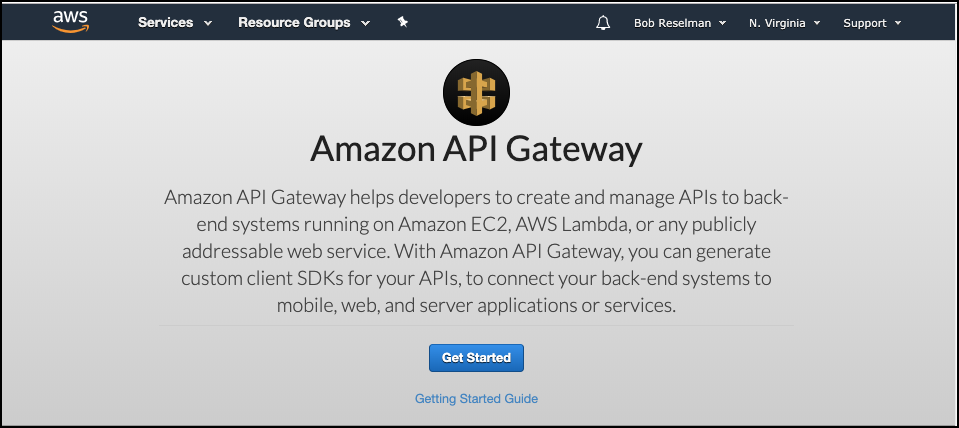
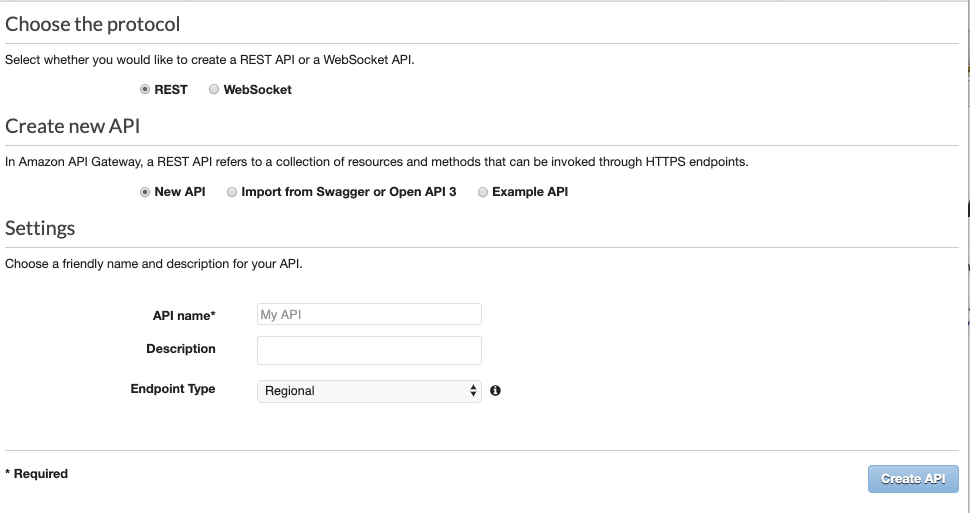
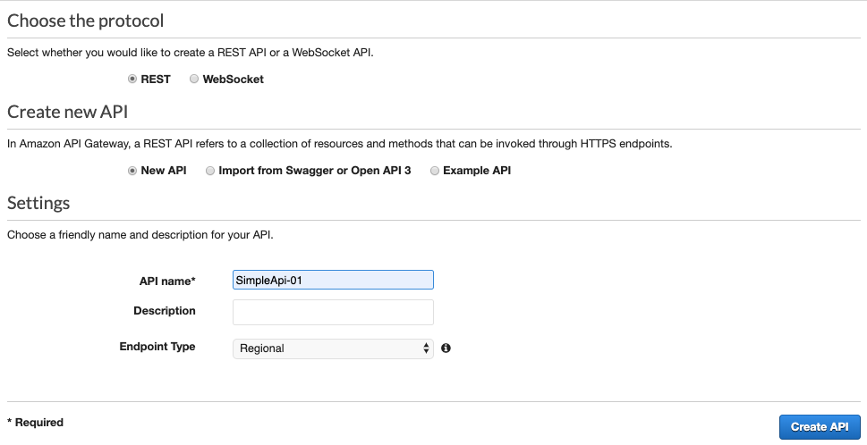
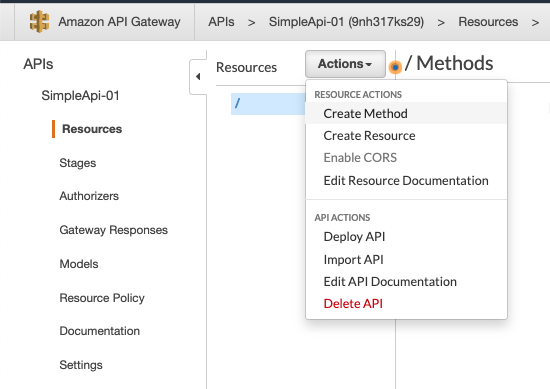
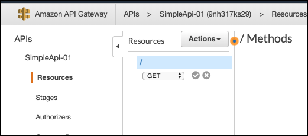
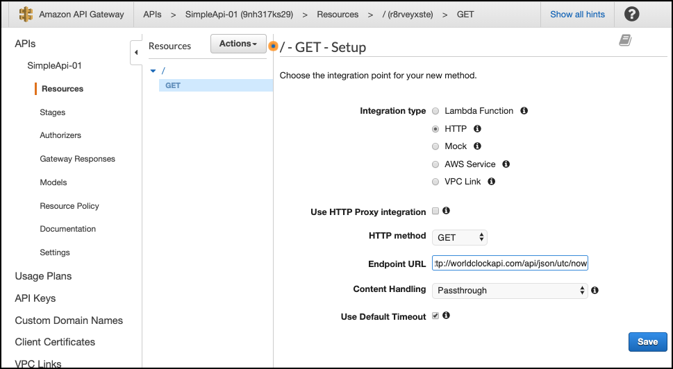
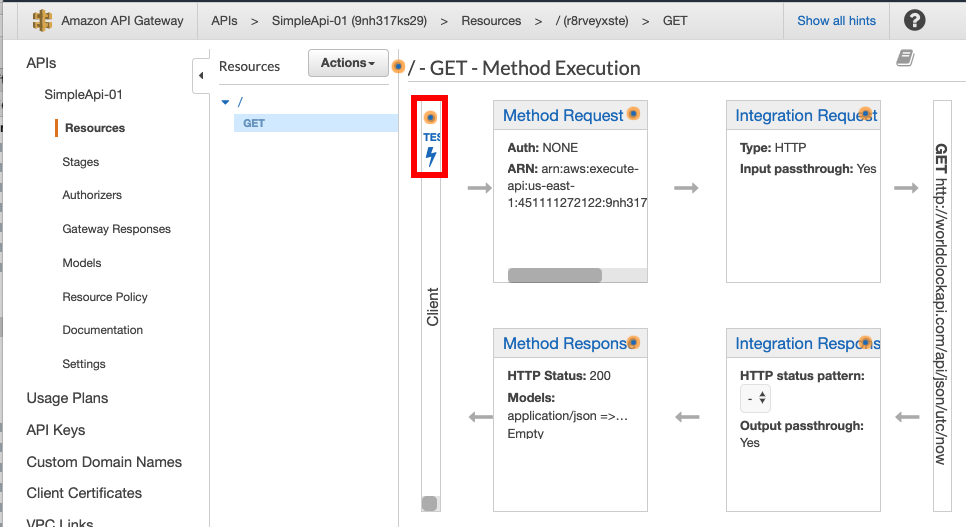
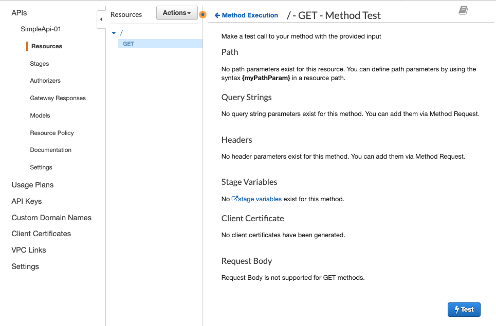
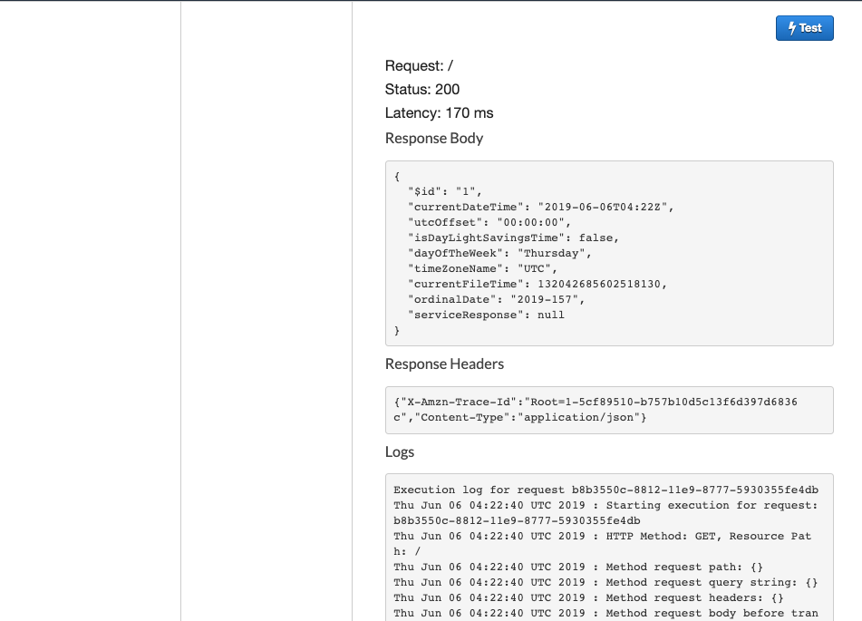

# Binding World Clock to an AWS API Gateway

`http://worldclockapi.com/api/json/utc/now`

Login to the AWS Console

`https://console.aws.amazon.com/apigateway/home?region=us-east-1#/welcome`

**Step 1**: Click the Get Started button

**Step 2**: Select the `REST` protocol And `New API`

**Step 3**: Set the `API Name` to `SimpleApi-01`

**Step 4**: From the `Actions` dropdown select, `Create Method`

**Step 5**: In the Method dropdown, select `GET` and then click the check.

**Step 6**: In the `GET-Setup` dialog, in the `Endpoint URL` enter the World Clock URL, `http://worldclockapi.com/api/json/utc/now`

**Step 7**: Click the `TEST` in the center column to the left of Method request to test the endpoint. This will display
the `TEST page.`

**Step 8**: Click the `Test` button on the lower right of the Test page.

**Step 9**: If all is well you should see the output from the call to the World Clock page

