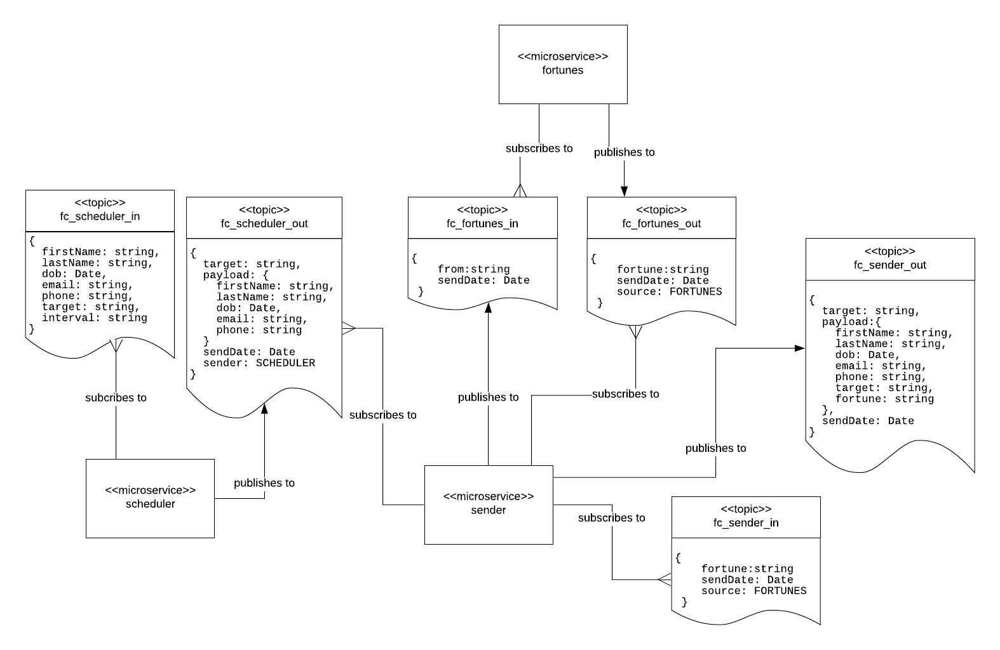

# Decomposing an Existing Monolothic Application in to a Microservice Oriented Application (MOA)

The purpose of this lab is to provide examples of how to decompose an existing monolithic
application called `Fortune Cookies` into an MOA.

Each version of `Fortune Cookies` is operational to some degree, with more feature being
implemented over time.

Scope of execution aside, the primary benefit of this lab is to provide code
examples of how to do the decomposition. 

Follow the installation and execution instructions provided in the `readme` page of each
version listed below. Please be advised that part of the automated installation process
that you'll perform for each MOA version will create a local Docker repository that will
store container images constructed from `Dockerfiles` in the source code.

If for some reason you experience difficulty during an installation process, all you need to do is to refresh the Katacoda
interactive learning environment in which the installation process is taking place.

## Monolithic version of Fortune Cookies

You can find the monolithic version of `Fortune Cookies` [here](https://github.com/reselbob/fortune-cookies/tree/master/monolith),
along with source code and execution instructions.

## Synchronous MOA version of Fortune Cookies

**Fortune Cookies MOA Synchronous version**

You can find the Synchronous MOA version of `Fortune Cookies` [here](https://github.com/reselbob/fortune-cookies/tree/master/microservice-sync).

This version isolates each microservice into its own web server.

## Asynchronous MOA version of Fortune Cookies

**Fortune Cookies MOA Asynchronous version ( excerpt)**

You can find the Asynchronous MOA version of `Fortune Cookies [here](https://github.com/reselbob/fortune-cookies/tree/master/microservice-async).
This version isolates each microservice into a distinct set of [message publishers/subscribers](https://en.wikipedia.org/wiki/Publish%E2%80%93subscribe_pattern).

